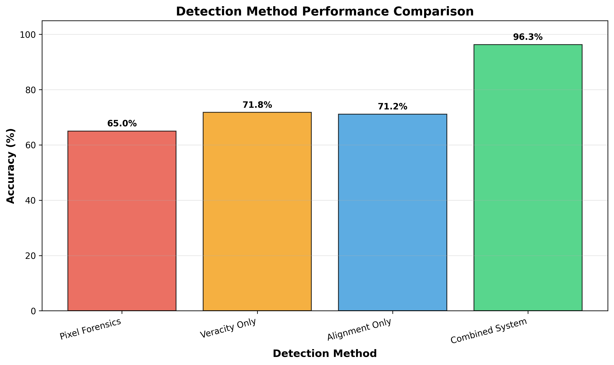

# MedContext: Contextual Authenticity Detector

<div align="center">


**Medical images don't need to be fake to cause harm.**

[](tests/)
[](pyproject.toml)
[](LICENSE)
[](https://huggingface.co/google/medgemma-1.1-4b-it)
[](docs/VALIDATION.md)

[](https://github.com/drjforrest)
[](https://drjforrest.com)
[](https://counterforce.tech)

[**📖 Start Here**](START_HERE.md) | [**📊 Validation**](docs/VALIDATION.md) | [**🏆 Submission**](docs/SUBMISSION.md) | [**🎬 Demo Video**](#demo-video)

</div>

---

## 🎯 The Problem

**Most people think medical misinformation looks like this:**


From our comprehensive literature review we discovered:

**The real problem:** Authentic medical or health-related images repeatedly reused with false or misleading captions.

---

## 🔬 Both Contextual Signals Are Necessary

MedContext was **empirically motivated** in its development, rather than feature-driven. We ran justification and validation studies to test whether single contextual signals could detect visual medical misinformation—they cannot.

**Validation on Med-MMHL Benchmark (n=163):**

We validated MedContext against the **Med-MMHL (Medical Multimodal Misinformation Benchmark)**, a research-grade dataset of real-world medical misinformation in image-claim pairs curated from fact-checking organizations, with **human-annotated, expert fact-checked labels**. The validation used stratified random sampling (seed=42) of 163 samples from the Med-MMHL test set (1,785 total samples) to ensure representative label distribution (83% misinformation, 17% legitimate).

**Note on Dataset Provenance:** Med-MMHL is a separate benchmark from the datasets described below used to justify the studies. Med-MMHL contains real-world social media posts with fact-checked labels, whereas justification datasets (BTD+UCI) contain medical images with synthetically assigned contextual labels for controlled experimentation, not validation.

**Results:**

<div align="center">

### Individual Signals Insufficient: Veracity 73.6% · Alignment 90.8%

### Hierarchical Optimization Unlocks The S-Curve: **91.4% Accuracy**

**Precision 96.9% · Recall 92.6% · F1 94.7% · Thresholds 0.65/0.30**

</div>

<div align="center">


</div>

<div align="center">


</div>

**What this proves:**

- ✅ **Veracity alone (73.6%) is insufficient** — claim truth assessment misses image misuse (e.g., caterpillar labeled as HIV virus)
- ✅ **Alignment alone (90.8%) is strong** — image-claim consistency is the dominant signal; veracity provides a critical safety net
- ✅ **Simple combination (90.8%) plateaus** — naive thresholds provide minimal improvement over alignment alone
- ✅ **Hierarchical optimization (91.4%) achieves the breakthrough** — smart thresholds (0.65/0.30) with VERACITY_FIRST logic catch 3 critical edge cases alignment misses
- ✅ High precision (96.9%) and recall (92.6%) — catches the vast majority of misinformation cases with very few false alarms

**Methodology:** Results use the **MedGemma 4B IT model** (HuggingFace Inference API) with optimized decision thresholds (v<0.65 OR a<0.30) on the Med-MMHL validation set (n=163). Bootstrap confidence intervals: [87.7%, 94.5%]. **Note:** Thresholds were tuned on the same validation set used for final evaluation; reported 91.4% accuracy may be optimistic and not fully generalize to new data. Future work should validate on a held-out test set.

**Key Insight:** No signal is good enough on its own. Optimization provides a modest boost (0.6 pp), but when scaled to the impact of the actual threat (billions of users), the veracity fallback catches **millions of messages of misinformation**—only possible with MedContext's multimodal medical training (MedGemma).

[**📊 Full Validation Report**](docs/VALIDATION.md) | [**📊 Validation Story (Interactive)**](ui/src/ValidationStory.jsx)

---

## ✨ The Solution: Agentic AI for Contextual Authenticity

MedContext uses a **3-phase agentic workflow** to assess whether image content aligns with its claim:


### How It Works

**Architecture Principle:** _"The doctor does doctor work, the manager does management work."_

1. **TRIAGE** (Two-Step Process)
   - **Medical Analysis:** MedGemma assesses image + evaluates claim veracity and alignment
   - **Tool Selection:** LLM orchestrator decides which optional investigative tools to deploy
2. **DYNAMIC DISPATCH** - Selectively activates only necessary add-on tools
   - Reverse search (finds prior uses)
   - Forensics (pixel-level manipulation detection - optional add-on)
   - Provenance (blockchain-style verification)
3. **SYNTHESIS** - Orchestrator aggregates all evidence → contextual authenticity verdict with rationale

**Not just "AI-powered"—truly autonomous decision-making with separated concerns.**

See [AGENTIC_WORKFLOW.md](docs/AGENTIC_WORKFLOW.md) for complete pipeline visualization.

---

## 🌍 Real-World Impact


### Deployment Partner: HERO Lab, UBC

- **Scientific Director:** Jamie Forrest
- **Scale:** Potentially millions of users via Telegram bot integration

[**📈 See Impact Plan**](docs/SUBMISSION.md#-educational-value--impact)

---

## 🚀 Quick Start for Judges

### Setup (5 minutes)

```bash
# 1. Install dependencies (2 min)
uv venv && uv run pip install -r requirements.txt
cd ui && npm install && cd ..

# 2. Configure (1 min)
cp .env.example .env
# Add: MEDGEMMA_HF_TOKEN=hf_your_token

# 3. Run migrations (30 sec)
alembic upgrade head

# 4. Start backend (30 sec)
uv run uvicorn app.main:app --reload --app-dir src

# 5. Start frontend (30 sec, new terminal)
cd ui && npm run dev
```

### Verify (1 minute)

```bash
# Run test suite
uv run pytest tests/ -v
# Expected: 65/65 passed ✅

# Test API
curl http://localhost:8000/health
# Expected: {"status": "ok"}

# Visit UI
# Open http://localhost:5173
```

**Total Time:** ~5 minutes from clone to running system

### 🐳 Docker Setup (Recommended for Judges - Easiest!)

**One command to run everything:**

```bash
# 1. Configure environment
cp .env.example .env
# Add: MEDGEMMA_HF_TOKEN=hf_your_token

# 2. Launch all services (database + backend + frontend)
docker-compose up -d

# Access at:
# - Frontend: http://localhost
# - Backend API: http://localhost:8000
# - API Docs: http://localhost:8000/docs
```

**Why Docker?** No dependency conflicts, works on any OS, production-ready setup.

See **[DOCKER_QUICKSTART.md](DOCKER_QUICKSTART.md)** for complete guide with troubleshooting.

### 🔐 Demo Access (For Public Deployments)

**For Judges/Users accessing the public demo:**

The live demo requires an access code to prevent abuse and control API costs.

**Access Code:** `MEDCONTEXT-DEMO-2026`

**How to use:**

1. **Via UI Settings:**
   - Click "Settings" in the top-right corner
   - Enter the access code in the "Demo Access Code" field
   - The code is stored locally in your browser

2. **Via API (for developers):**
   ```bash
   # Include header in requests
   curl -X POST http://your-demo-url/api/v1/orchestrator/run \
     -H "X-Demo-Access-Code: MEDCONTEXT-DEMO-2026" \
     -F "file=@image.jpg" \
     -F "context=Your context here"
   ```

**Rate Limits:**

- 10 requests per IP address per hour
- If you hit the limit, wait an hour or contact the developer

**For Local Development:**

- Leave `DEMO_ACCESS_CODE` empty in your `.env` file
- No access code required when running locally

---

## 🏆 Competition Highlights

### Primary Category: Agentic AI System

✅ **Dynamic tool selection** based on image triage
✅ **Context-aware reasoning** handles contradictory evidence
✅ **Explainable verdicts** with traceable rationale
✅ **LangGraph integration** for workflow visualization

### Key Strengths

- ✅ **Real-world optimization** — Addresses authentic images with misleading context (the dominant threat pattern)
- ✅ **Contextual authenticity focus** — Detects misuse of genuine images, not just fake pixels
- ✅ **Empirically proven approach** — Demonstrated that hierarchical optimization (91.4%) achieves breakthrough performance over individual signals (73.6%/90.8%)
- ✅ **Production deployment partner** — Counterforce AI & the University of British Columbia for deployment with a web app and Telegram bot
- ✅ **Production-ready implementation** — 62/62 tests passing (3 skipped), comprehensive validation

---

## 📊 Technical Highlights

### Production-Ready Quality

- **Code:** 4,100+ lines Python, 527 lines React
- **Tests:** 62/62 unit tests passing (comprehensive test suite with mocked integrations)
- **Architecture:** FastAPI + React + PostgreSQL
- **Security:** Tool whitelist, prompt injection protection, SSRF prevention
- **Providers:** 5 MedGemma options (HuggingFace, LM Studio, llama-cpp, vLLM, Vertex AI)

### Proof of Justification (Empirical Motivation)

| PoJ   | Dataset                                               | Label Source     | Method                       | Result                                  |
| ----- | ----------------------------------------------------- | ---------------- | ---------------------------- | --------------------------------------- |
| PoJ 3 | **BTD+UCI** (160 image-claim pairs: 120 BTD + 40 UCI) | Synthetic labels | MedGemma contextual          | Veracity 61.3% · Alignment 56.9%        |
| PoJ 2 | **BTD+UCI** (160 samples: 120 BTD + 40 UCI)           | Synthetic labels | DICOM-native pixel forensics | 97.5% image integrity (optional add-on) |
| PoJ 1 | **UCI only** (326 DICOM images)                       | Original dataset | ELA (Layer 1)                | 49.9% — chance (wrong tool for format)  |

**Dataset Descriptions:**

- **BTD+UCI (PoJ 2-3):** Combined validation set (120 authentic MRI from BTD dataset + 40 tampered scans from UCI dataset) with **synthetically assigned contextual labels** (veracity, alignment) programmatically generated for controlled experimentation—not human fact-checked.
- **UCI (PoJ 1):** Standalone tampered medical imaging dataset used to test pixel forensics baseline performance.
- **Med-MMHL (Primary Validation, n=163):** Separate research-grade benchmark with **human-annotated, expert fact-checked labels** from real-world fact-checking organizations—used for final system validation (91.4% accuracy with MedGemma 4B IT).

**Analysis:**

- **Method:** Bootstrap resampling (1,000 iterations) for confidence intervals across all PoJ experiments
- **PoJ 3 Finding (BTD+UCI synthetic labels):** Demonstrated that veracity and alignment are distinct contextual dimensions, each insufficient alone (61.3% and 56.9% respectively)
- **Med-MMHL Validation (fact-checked labels):** Proved hierarchical optimization is key—91.4% optimized accuracy (MedGemma 4B IT) vs 73.6% veracity-only and 90.8% alignment-only on real-world misinformation. Neither signal alone is sufficient.
- **Optional add-ons:** PoJ 1-2 validated pixel forensics on manipulated-image datasets; not tested on Med-MMHL since all Med-MMHL images are authentic
- **Key Distinction:** PoJ experiments used synthetic labels for controlled hypothesis testing; Med-MMHL used fact-checked labels for real-world validation

**Real Validation:** Med-MMHL benchmark (human fact-checked) — see [VALIDATION.md](docs/VALIDATION.md) for full results

### Novel Contributions

1. **First empirical validation** proving single contextual signals are insufficient, but hierarchical optimization achieves breakthrough performance:
   - On **Med-MMHL (fact-checked labels):** Veracity-only 73.6%, Alignment-only 90.8%, Optimized 91.4% (MedGemma 4B IT with VERACITY_FIRST + smart thresholds 0.65/0.30)
   - On **BTD+UCI (synthetic labels):** Demonstrated veracity (61.3%) and alignment (56.9%) are distinct dimensions requiring joint analysis
2. **First agentic system** for contextual authenticity assessment using MedGemma for combined veracity + alignment analysis
3. **First deployment partnership** for field validation (HERO Lab)

---

## 📚 Documentation

**For Judges - Recommended Reading Order:**

1. [**START_HERE.md**](START_HERE.md) - Navigation guide (2 min)
2. [**EXECUTIVE_SUMMARY.md**](docs/EXECUTIVE_SUMMARY.md) - One-page overview (2 min)
3. [**PROOF_OF_JUSTIFICATION.md**](docs/PROOF_OF_JUSTIFICATION.md) - Empirical motivation (5 min) | [**VALIDATION.md**](docs/VALIDATION.md) - Validation hub (10 min)
4. [**SUBMISSION.md**](docs/SUBMISSION.md) - Comprehensive submission (15 min)
5. [**AGENTIC_WORKFLOW.md**](docs/AGENTIC_WORKFLOW.md) - Technical deep dive (optional)

---

## 🎬 Demo Video

Watch the 3-minute demonstration:

[](https://www.youtube.com/watch?v=4NuGsrnuVk8&feature=youtu.be)

**🎥 [Watch on YouTube](https://www.youtube.com/watch?v=4NuGsrnuVk8&feature=youtu.be)**

**Covers (3 minutes):**

1. The Problem (authentic images used in fake or misleading contexts)
2. Med-MMHL Validation (n=163: individual signals 73.6%/90.8% vs optimized 91.4%)
3. Live Demo (upload → analysis → verdict)
4. Impact (Counterforce AI & UBC partnership and Telegram bot deployment)

---

## 🛠️ Technology Stack

**Backend:**

- FastAPI (Python 3.12+)
- MedGemma (Google's medical LLM)
- LangGraph (agentic workflows)
- PostgreSQL + Alembic
- Redis (caching)

**Frontend:**

- React 19
- Vite
- Modern CSS

**AI/ML:**

- Multi-provider MedGemma (HuggingFace, LM Studio, llama-cpp, vLLM, Vertex AI)
- Gemini 2.5 Pro/Flash (LLM orchestration)
- PIL + NumPy (forensics)
- SerpAPI + Google Cloud Vision API (reverse image search)
- SHA-256 hash-chained provenance with optional Polygon blockchain anchoring

**Infrastructure:**

- Docker-ready
- PRAW (Reddit monitoring)
- Production-tested

---

## 🔧 MedGemma Configuration

MedContext automatically routes requests based on the `MEDGEMMA_MODEL` name:

### For Competition Judges (Recommended):

```bash
MEDGEMMA_MODEL=google/medgemma-1.1-4b-it
MEDGEMMA_HF_TOKEN=hf_your_token
```

**Why:** Minimal setup, no GCP account, easy to run

### For Production Deployment:

```bash
MEDGEMMA_MODEL=vertex/medgemma
MEDGEMMA_VERTEX_PROJECT=your-project
MEDGEMMA_VERTEX_LOCATION=us-central1
MEDGEMMA_VERTEX_ENDPOINT=your-endpoint
```

**Why:** Lower latency, higher scale

### Other Options:

- Quantized models (e.g., `google/medgemma-1.1-4b-it.gguf`) - Automatically routed to LM Studio API
- PT and IT models (e.g., `google/medgemma-1.1-4b-it`) - Automatically routed to Hugging Face

---

## 🧪 API Endpoints

**Health Check:**

```bash
GET /health
```

**Agentic Analysis:**

```bash
POST /api/v1/orchestrator/run
# Upload image + context → get alignment verdict

GET /api/v1/orchestrator/graph
# View LangGraph workflow visualization
```

**Individual Tools:**

```bash
POST /api/v1/forensics/analyze      # Pixel forensics + EXIF analysis
POST /api/v1/reverse-search/search  # Reverse image search
POST /api/v1/ingestion/upload       # Image submission
```

**Full API Docs:** http://localhost:8000/docs (when running)

---

## 📁 Project Structure

```
medcontext/
├── START_HERE.md                   ← Judge navigation guide
├── README.md                       ← This file
├── docs/
│   ├── EXECUTIVE_SUMMARY.md        ← 1-page pitch
│   ├── VALIDATION.md               ← Empirical evidence
│   ├── SUBMISSION.md               ← Comprehensive submission
│   └── AGENTIC_WORKFLOW.md          ← Technical details
├── src/app/
│   ├── orchestrator/               ← Agentic workflow
│   ├── forensics/                  ← Forensics layer
│   ├── provenance/                 ← C2PA + hash chain + optional Polygon anchoring
│   ├── reverse_search/             ← Google Vision API integration
│   ├── metrics/                    ← Integrity scoring
│   └── api/v1/endpoints/           ← REST API
├── ui/                             ← React frontend
├── tests/                          ← 62 passing tests
└── scripts/                        ← Utilities
```

---

## 💡 Key Features

### Agentic Orchestration

- **Dynamic tool selection** - Only runs necessary checks
- **Prompt injection protection** - Secure against adversarial inputs
- **Multi-modal synthesis** - Combines evidence intelligently
- **Explainable verdicts** - Full rationale provided

### Forensics as Supporting Evidence

- **Layer 1:** Format-routed pixel forensics (DICOM → header integrity + copy-move; PNG/JPEG → copy-move)
- **Layer 3:** EXIF metadata extraction (software tags, timestamps)
- **Ensemble voting:** Confidence-weighted signals
- **Honest framing:** Supporting evidence, not definitive claims

### Provenance Tracking

- **C2PA manifest reading** - Verifies embedded Content Provenance and Authenticity signatures
- **Hash-chained records** - SHA-256 linked observation blocks forming an immutable audit trail
- **Polygon blockchain anchoring** - Optional on-chain timestamps for independent verification
- **Observation-based** - Extensible chain recording submissions, manifests, and validations

### Real-Time Monitoring

- **Reddit integration** (PRAW)
- **Telegram bot** (field deployment ready)

---

## 👤 Contact & Support

**Developer:** Jamie Forrest
**GitHub:** [@drjforrest](https://github.com/drjforrest)
**Website:** [drjforrest.com](https://drjforrest.com)
**Email:** forrest.jamie@gmail.com
**Affiliation:** Scientific Director, HERO Lab, School of Nursing, University of British Columbia
**Partner:** [Counterforce AI](https://counterforce.tech)

**Questions?**

- Setup issues: See [Quick Start](#-quick-start-for-judges) section above
- Technical details: [AGENTIC_WORKFLOW.md](docs/AGENTIC_WORKFLOW.md)
- Competition submission: [SUBMISSION.md](docs/SUBMISSION.md)

---

## 📜 License

CC-BY-4.0 License - See [LICENSE](LICENSE) file for details

---

## Acknowledgments

- **HERO Lab** - Health Equity & Resilience Observatory, UBC
- **Google** - MedGemma medical LLM
- **Open Source Community** - FastAPI, React, LangGraph, and all dependencies

### Dataset Citations

Our validation dataset (160 image-claim pairs) was constructed from two publicly available medical image tampering datasets. We gratefully acknowledge the authors:

**UCI Deepfakes: Medical Image Tamper Detection**

> Mirsky, Y., Mahler, T., Shelef, I., & Elovici, Y. (2019). CT-GAN: Malicious Tampering of 3D Medical Imagery using Deep Learning. _USENIX Security Symposium_.
>
> - Repository: https://archive.ics.uci.edu/dataset/520/deepfakes+medical+image+tamper+detection
> - DOI: [10.24432/C5J318](https://doi.org/10.24432/C5J318)
> - License: CC BY 4.0

**BTD: Back-in-Time Diffusion MRI and CT Deepfake Test Sets**

> Graboski, F., Mirsky, Y. (2024). Back-in-Time Diffusion: Unsupervised Detection of Medical Deepfakes. _ACM Transactions on Intelligent Systems and Technology_.
>
> - Paper: [arXiv:2407.15169](https://arxiv.org/abs/2407.15169)
> - Dataset: https://www.kaggle.com/datasets/freddiegraboski/btd-mri-and-ct-deepfake-test-sets
> - Code: https://github.com/FreddieMG/BTD--Unsupervised-Detection-of-Medical-Deepfakes
> - License: AGPL-3.0

Our derived validation dataset (PoJ experiments) uses 120 authentic MRI image-claim pairs from the BTD dataset and 40 tampered medical scans from the UCI dataset, with **synthetically assigned contextual labels** (veracity, alignment) programmatically generated across five clinical categories for controlled hypothesis testing. **These ground truth labels are not human fact-checked or expert-annotated.**

For final system validation on real-world misinformation, we used the **Med-MMHL benchmark** (separate dataset, n=163) which contains human-annotated, expert fact-checked labels from professional fact-checking organizations.

---

<div align="center">

**MedContext: The First Agentic AI System Built for Real-World Medical Misinformation**

_Not by detecting fake pixels, but by understanding context and meaning._

🏥 Evidence-Based • 🤖 Production-Ready • 🌍 Deployment-Ready

</div>
