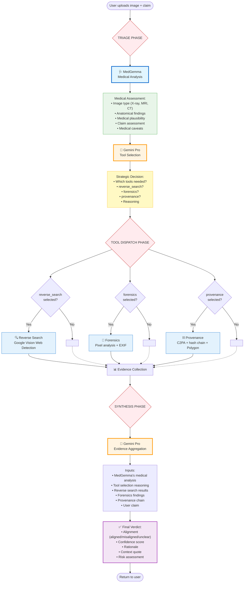

# MedContext Agentic Workflow

This document describes the complete agentic workflow pipeline with separated concerns between medical expertise (MedGemma) and strategic orchestration (LLM Orchestrator).

## Architecture Principle

**"The doctor does doctor work, the manager does management work."**

- **MedGemma** provides medical domain expertise
- **LLM Orchestrator** (Gemini Pro) makes strategic tool selection and synthesis decisions

## Complete Pipeline



## Phase Details

### Phase 1: Triage (Two Steps)

#### Step 1: Medical Analysis (MedGemma)

**Role:** Medical domain expert

**Inputs:**
- Medical image (bytes)
- User claim (optional)

**Outputs:**
```json
{
  "image_type": "Chest X-ray (posteroanterior view)",
  "anatomy": "Bilateral lung fields, heart, mediastinum",
  "findings": "Bilateral infiltrates consistent with pneumonia",
  "claim_assessment": {
    "plausibility": "high",
    "reasoning": "COVID-19 can manifest as pneumonia...",
    "verifiable_from_image": "Pneumonia is visible, but cause cannot be determined",
    "additional_verification_needed": "RT-PCR or antigen testing",
    "medical_caveats": "Radiographic findings are not specific to COVID"
  }
}
```

**Does NOT:**
- Decide which investigative tools to use
- Make strategic orchestration decisions

#### Step 2: Tool Selection (Gemini Pro Orchestrator)

**Role:** Strategic investigative orchestration

**Inputs:**
- MedGemma's medical analysis
- User claim

**System Prompt:**
```
You are an investigative orchestration agent. Your role is to decide which
investigative tools to deploy based on medical image analysis and user claims.

CRITICAL: You are NOT a medical expert. Medical analysis is provided by MedGemma,
a specialized medical AI. Your job is ONLY to decide which investigative tools to use.
```

**Outputs:**
```json
{
  "tools": ["reverse_search", "provenance"],
  "reasoning": "Medical analysis indicates claim is plausible but unverifiable from image alone. Need to verify image hasn't been repurposed from different patient/context."
}
```

**Strategic Considerations:**
1. If medically plausible → verify image source (reverse_search, provenance)
2. If medically implausible → check for manipulation (forensics)
3. If high-stakes context → verify provenance chain
4. Consider computational cost

### Phase 2: Tool Dispatch

**Available Tools:**

| Tool | Purpose | When Used |
|------|---------|-----------|
| **reverse_search** | Find prior uses of this image online via Google Cloud Vision API Web Detection | Detect image misuse or repurposing |
| **forensics** | Analyze pixel-level manipulation evidence (DICOM header integrity, copy-move, EXIF) | When image authenticity is questionable |
| **provenance** | Read C2PA manifests, build SHA-256 hash-chained observation blocks, optionally anchor to Polygon blockchain | Establish image history and genealogy |

**Dynamic Execution:**
- Only runs tools selected by orchestrator
- Typically 60% faster for genuine images (doesn't run unnecessary forensics)
- Each tool provides specific evidence

### Phase 3: Synthesis

**Role:** Gemini Pro Orchestrator aggregates all evidence

**Inputs:**
- MedGemma's medical analysis (authoritative medical input)
- Tool selection reasoning
- Reverse search results
- Forensics findings (if run)
- Provenance chain (if run)
- User claim

**Outputs:**
```json
{
  "part_1": {
    "image_description": "Factual description of image content"
  },
  "part_2": {
    "alignment": "misaligned",
    "confidence": 0.82,
    "verdict": "While the X-ray findings are consistent with COVID-19 pneumonia, reverse search reveals this image was published in a 2020 medical journal about bacterial pneumonia in a different patient.",
    "rationale": "MedGemma confirmed the radiographic findings could represent COVID. However, provenance checking shows this is not the claimant's image—it's being repurposed.",
    "claim_risk": "high"
  },
  "contextual_integrity": {
    "score": 0.25,
    "alignment": "misaligned"
  }
}
```

## Example Scenario: "My Nan's COVID X-ray"

**Input:**
- Image: Chest X-ray showing pneumonia
- Claim: "This is a chest X-ray of my nan with COVID"

**Flow:**

1. **MedGemma Analysis:**
   - "Bilateral infiltrates consistent with pneumonia"
   - "COVID can cause pneumonia, so claim is medically plausible"
   - "However, cannot confirm COVID from X-ray alone—requires RT-PCR"

2. **Orchestrator Tool Selection:**
   - "Medical analysis says plausible but unverifiable"
   - "Should verify this specific image matches this specific patient"
   - **Selected tools:** `["reverse_search", "provenance"]`
   - **Reasoning:** "Need to verify image hasn't been repurposed"

3. **Tool Execution:**
   - Reverse search finds: Image in 2020 medical journal about bacterial pneumonia
   - Provenance: Cannot verify original patient identity

4. **Orchestrator Synthesis:**
   - **Verdict:** MISALIGNED (confidence: 0.75)
   - **Rationale:** "Medically plausible, but image is being used out of context"
   - **Medical note:** "The X-ray is genuine and shows pneumonia, but it's not nan's X-ray"

## Key Architectural Benefits

### ✅ Separation of Concerns
- Medical questions → MedGemma
- Strategic questions → Gemini Pro
- Each model operates in its domain of expertise

### ✅ Medical Accuracy Preserved
- MedGemma provides nuanced medical reasoning
- Orchestrator respects medical plausibility assessments
- No false dismissals of medically valid claims

### ✅ Strategic Optimization
- Orchestrator uses superior reasoning for tool selection
- Cost-effective (doesn't run unnecessary tools)
- Scalable and configurable (can swap orchestrator LLM)

### ✅ Transparency
- Clear attribution of each decision
- Traceable reasoning at every step
- Auditable evidence chain

## Implementation

See `src/app/orchestrator/langgraph_agent.py` for the complete implementation.

**Key methods:**
- `_get_medical_analysis()` - MedGemma medical expertise
- `_orchestrate_tool_selection()` - Gemini Pro strategic decisions
- `_synthesize()` - Gemini Pro evidence aggregation

## Configuration

Set in `.env`:
```bash
# MedGemma provider (for medical analysis)
MEDGEMMA_PROVIDER=huggingface
MEDGEMMA_HF_TOKEN=hf_your_token

# LLM Orchestrator (for triage and synthesis)
LLM_ORCHESTRATOR=google/gemini-2.0-flash-exp
LLM_WORKER=google/gemini-2.0-flash-exp

# OpenRouter API
OPENROUTER_API_KEY=your_key
```

---

**Built for the Kaggle MedGemma Impact Challenge**
**Architecture: Right tool for the right job**
